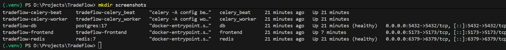
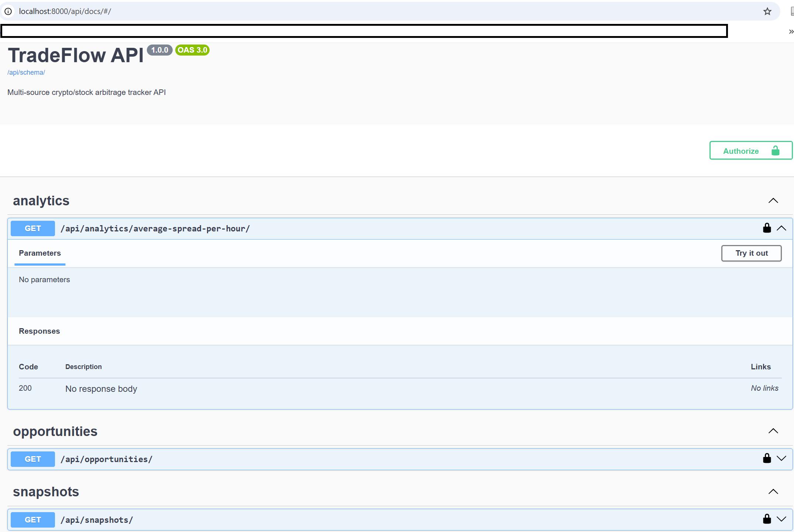
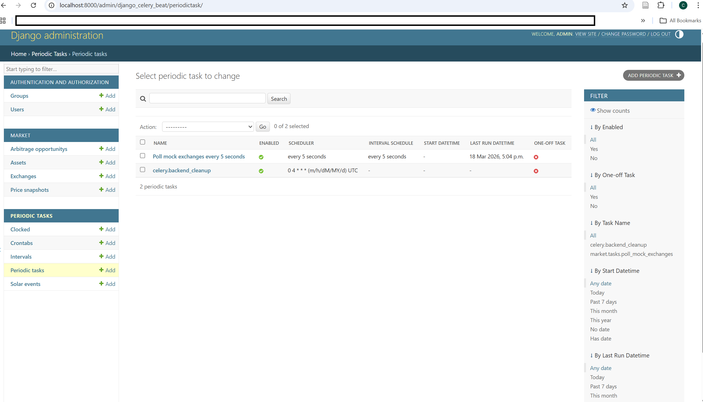
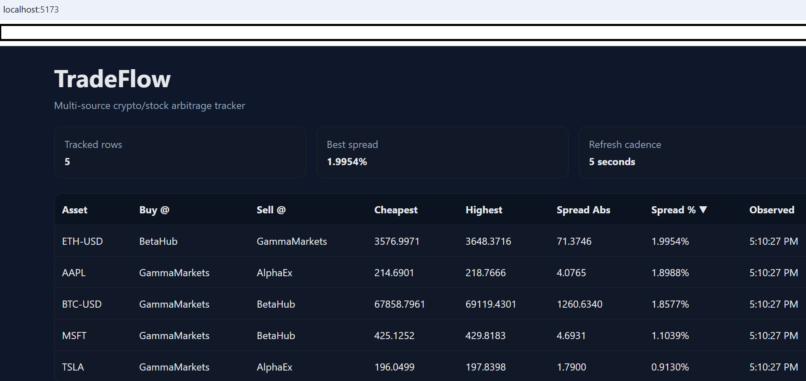
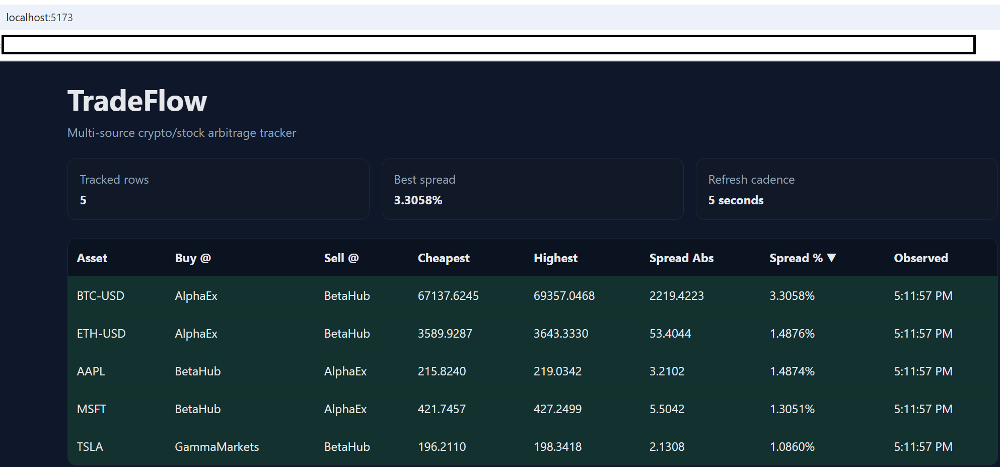

# TradeFlow

Multi-source crypto/stock arbitrage tracker built with React, TypeScript, Django, Django REST Framework, PostgreSQL, Redis, Celery, django-celery-beat, and Docker Compose.

## Highlights

- Polls 3 mock exchanges every 5 seconds with Celery Beat
- Stores historical price snapshots in PostgreSQL
- Computes latest arbitrage opportunities and hourly average spread analytics
- React + TypeScript dashboard with TanStack Table
- CSS flash effect whenever a row changes
- Swagger / OpenAPI docs with drf-spectacular
- Custom Django middleware that logs request latency
- Full Docker Compose stack for local development

## Stack

- Frontend: React, TypeScript, Vite, TanStack Table
- Backend: Django, Django REST Framework, drf-spectacular
- Data: PostgreSQL
- Queue / Scheduler: Redis, Celery, django-celery-beat
- Containers: Docker Compose

## Project Structure

```text
TradeFlow/
├── .gitignore
├── README.md
├── docker-compose.yml
├── backend/
│   ├── .dockerignore
│   ├── .env
│   ├── Dockerfile
│   ├── manage.py
│   ├── requirements.txt
│   ├── config/
│   │   ├── __init__.py
│   │   ├── asgi.py
│   │   ├── celery.py
│   │   ├── settings.py
│   │   ├── urls.py
│   │   └── wsgi.py
│   └── market/
│       ├── __init__.py
│       ├── admin.py
│       ├── apps.py
│       ├── middleware.py
│       ├── models.py
│       ├── seed_scheduler.py
│       ├── serializers.py
│       ├── tasks.py
│       ├── urls.py
│       ├── views.py
│       └── migrations/
│           ├── __init__.py
│           └── 0001_initial.py
├── frontend/
│   ├── .env
│   ├── Dockerfile
│   ├── index.html
│   ├── package.json
│   ├── tsconfig.json
│   ├── vite.config.ts
│   └── src/
│       ├── App.tsx
│       ├── api.ts
│       ├── index.css
│       ├── main.tsx
│       ├── types.ts
│       ├── vite-env.d.ts
│       └── components/
│           └── OpportunitiesTable.tsx
└── screenshots/
    ├── docker-healthy-services.png
    ├── backend-swagger.png
    ├── backend-admin-periodic-task.png
    ├── frontend-dashboard.png
    └── frontend-flash-effect.png
````

## Architecture

TradeFlow is a local full-stack application that simulates a market data ingestion pipeline and exposes arbitrage insights through a dashboard.

### Backend flow

1. Celery Beat triggers a scheduled task every 5 seconds.
2. The task polls 3 mock exchanges for 5 tracked assets.
3. New price snapshots are stored in PostgreSQL.
4. The latest arbitrage opportunity for each asset is updated.
5. Django REST Framework exposes API endpoints for opportunities, snapshots, and hourly spread analytics.
6. drf-spectacular exposes OpenAPI schema and Swagger UI documentation.

### Frontend flow

1. The React dashboard requests arbitrage opportunities from the backend API.
2. Data is displayed in a sortable TanStack Table.
3. The UI refreshes automatically every 5 seconds.
4. Updated rows briefly flash green to highlight changes.

## Local Run

From the project root:

```bash
docker compose up --build -d
```

## Local URLs

* Frontend: `http://localhost:5173`
* Swagger docs: `http://localhost:8000/api/docs/`
* Opportunities API: `http://localhost:8000/api/opportunities/`
* Snapshots API: `http://localhost:8000/api/snapshots/`
* Analytics API: `http://localhost:8000/api/analytics/average-spread-per-hour/`
* Django admin: `http://localhost:8000/admin/`

## Admin Login

* Username: `admin`
* Password: `admin123456`

## Services

The Docker Compose stack starts these services:

* `tradeflow-db`
* `tradeflow-redis`
* `tradeflow-backend`
* `tradeflow-celery-worker`
* `tradeflow-celery-beat`
* `tradeflow-frontend`

## API Endpoints

### Core endpoints

* `GET /api/opportunities/`
* `GET /api/snapshots/`
* `GET /api/analytics/average-spread-per-hour/`

### API documentation

* `GET /api/docs/`
* `GET /api/schema/`

## Development Notes

* Python host version kept at `3.13.12`
* Backend Docker image uses `python:3.13-slim`
* Node host version kept at `v24.13.0`
* Frontend is built with strict TypeScript enabled
* Backend runtime is containerized, while local Python virtual environment is used for package installation and migration generation
* The backend `.env` and frontend `.env` are ignored by Git

## Verification Checklist

### Backend

* Swagger UI loads successfully
* Opportunities endpoint returns JSON data
* Analytics endpoint returns hourly aggregation data
* Django admin login works
* Periodic task is seeded automatically
* Price snapshots and arbitrage opportunities are populated continuously
* Celery Beat logs scheduled dispatches
* Celery Worker logs successful task execution

### Frontend

* Dashboard loads successfully
* Summary cards render correctly
* Table sorts by spread
* Rows refresh every 5 seconds
* Changed rows flash green
* `npm run build` completes successfully without TypeScript errors

## Screenshot Evidence

### Docker services healthy



### Backend Swagger docs



### Backend admin with periodic task and data



### Frontend dashboard



### Frontend flash effect



## Command Reference

### Root directory

Run from:

```text
D:\Projects\TradeFlow
```

```powershell
git init
git branch -M main
docker compose up --build -d
docker compose ps
docker compose logs backend --tail 100
docker compose logs celery_worker --tail 100
docker compose logs celery_beat --tail 100
docker compose logs frontend --tail 100
git add .
git commit -m "message"
git remote add origin https://github.com/YOUR_GITHUB_USERNAME/TradeFlow.git
git push -u origin main
```

### Backend directory

Run from:

```text
D:\Projects\TradeFlow\backend
```

```powershell
python -m venv .venv
.\.venv\Scripts\Activate.ps1
python -m pip install --upgrade pip setuptools wheel
pip install Django==5.2.12 djangorestframework==3.16.1 drf-spectacular celery redis psycopg[binary] django-celery-beat django-cors-headers
pip freeze > requirements.txt
django-admin startproject config .
python manage.py startapp market
python manage.py makemigrations
```

### Frontend directory

Run from:

```text
D:\Projects\TradeFlow\frontend
```

```powershell
npm install
npm install @tanstack/react-table
npm run build
npm run dev
```

## Atomic Commit Sequence

```text
chore: initialize repository and root gitignore
feat: scaffold Django backend with virtual environment dependencies
feat: add Django settings middleware and API docs configuration
feat: add market domain models serializers and API endpoints
feat: add Celery tasks for mock exchange polling
feat: add Docker Compose stack for Django Postgres Redis and Celery
feat: scaffold React TypeScript frontend with strict mode
feat: add arbitrage dashboard with TanStack Table and flash effect
docs: add README with architecture usage and screenshot evidence
```

## Why This Repository Is Strong

This project demonstrates:

* relational data modeling with Django ORM and PostgreSQL
* scheduled ingestion with Celery Beat
* asynchronous worker execution with Celery
* API-first backend delivery with OpenAPI docs
* strict TypeScript in the frontend
* performance awareness through custom latency middleware
* reproducible full-stack startup through Docker Compose

## Submission Readiness

TradeFlow is submission-ready when all of the following are true:

* folder structure matches the target structure
* local repository exists and uses `main`
* all nine commits exist in the intended order
* Docker Compose starts six services
* backend endpoints work
* admin login works
* frontend displays live data
* flash effect is captured in a screenshot
* README renders images on GitHub
* repository is pushed to GitHub
